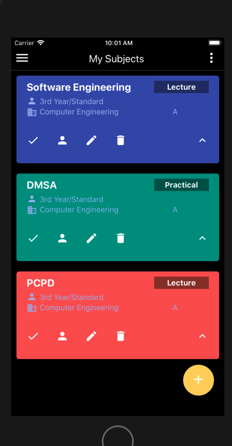
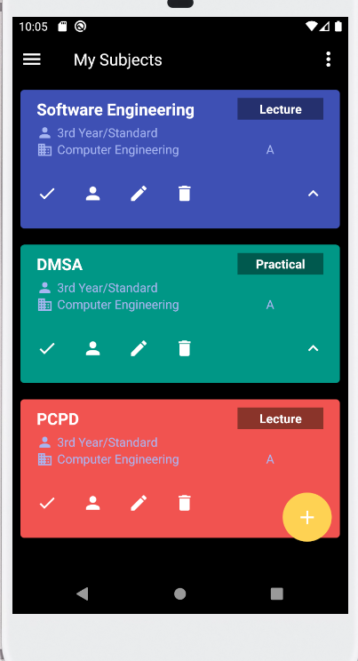

# Template_RN

Simple Template for React Native Project  
RN version: 0.61.5  

Library installed:
1. Native Base
2. React Navigation
3. React Redux
4. React Native Linier Gradient
5. React Native Responsive Dimension
6. React Native Vector Icons

How to run? 
1. clone this project
2. cd 'project name'
3. npm install
4. cd ios
5. pod install
6. react-native start
7. react-native run-android / react-native run-ios

